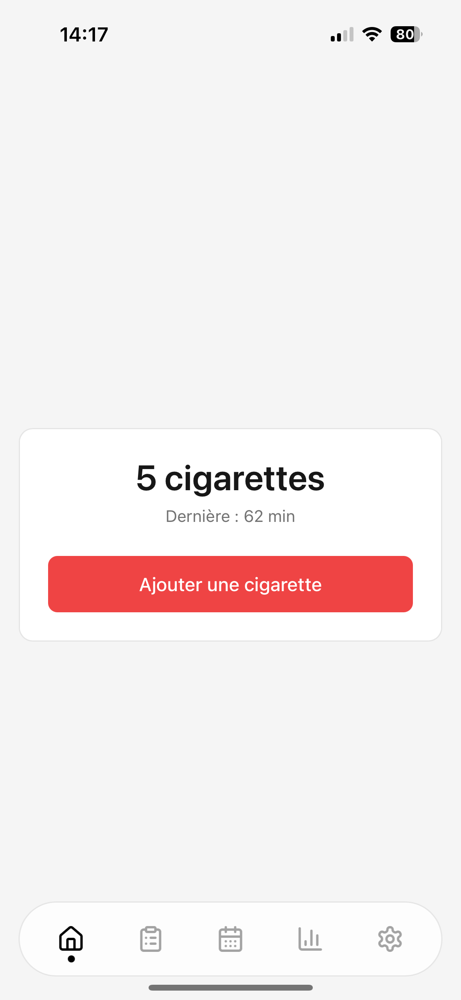
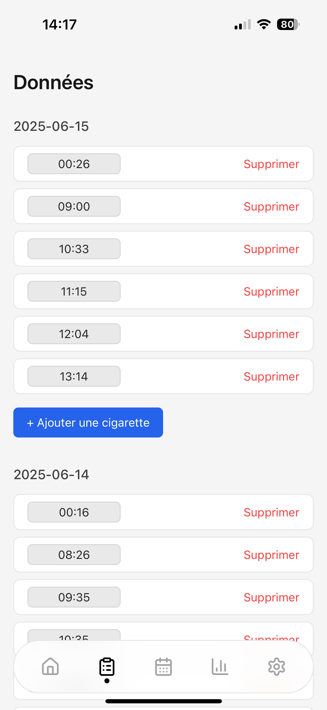
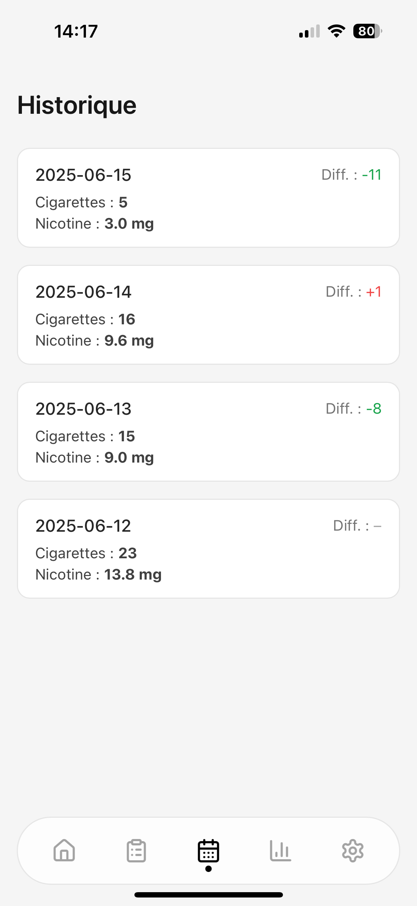
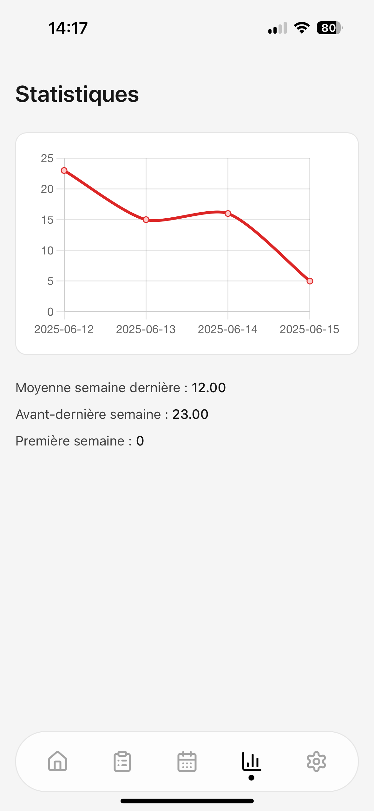
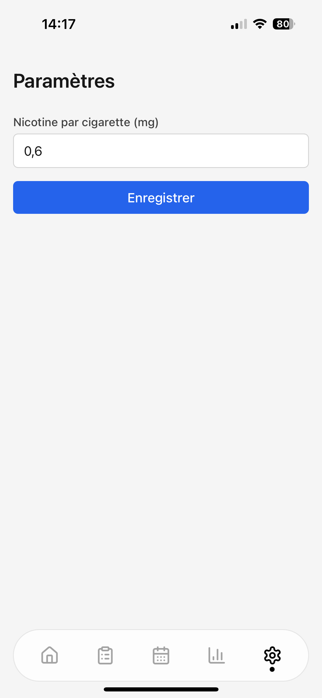
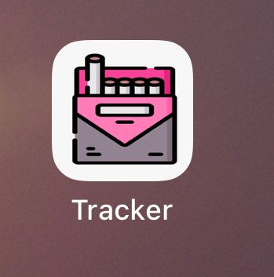

# CigTracker

A minimalist and responsive **Progressive Web App (PWA)** to help you track your cigarette consumption — inspired by Apple’s flat design principles.

Built with **Vue 3**, **Tailwind CSS**, and **Chart.js**.

---

## 📱 Screenshots

### Home screen



- Tap to log a cigarette
- Time since last cigarette
- Soft neutral background (`#f5f5f5`)

---

### Time-based tracking



- View all smoking events per day
- Modify or delete entries
- Smooth layout, iOS-friendly inputs

---

### Daily history summary



- Number of cigarettes per day
- Nicotine intake (customizable)
- Difference vs previous day (with color)

---

### Statistics view



- 📈 Line chart: cigarettes per day
- 📊 Weekly averages
- Clean and readable

---

### Settings



- Set nicotine per cigarette
- Stored in localStorage
- Persistent across sessions

---

### App icon



- Installable as a native-like PWA
- Looks great on iOS home screen

---

## ✨ Features

- One-tap logging
- Daily and time-based history
- Weekly stats with charts
- Offline-first & localStorage only
- Lightweight, responsive UI

---

## 🧱 Tech Stack

- **Vue 3** (Composition API)
- **Tailwind CSS** (flat + mobile-first)
- **Chart.js** (line chart)
- **localStorage** (no backend)
- **PWA** support (manifest + meta viewport)

---

## 📦 Setup

```bash
npm install
npm run dev
