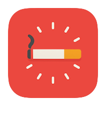

# CigTracker



**CigTracker** is a minimalist and responsive **Progressive Web App (PWA)** designed to help you reduce cigarette consumption without the pressure of quitting cold turkey. Log each cigarette with a tap, visualize your habits, and track your progress over time.

Built with **Vue 3**, **Tailwind CSS**, and **Chart.js**.

---

## 🔍 Overview

- Tap to log a cigarette instantly
- Track time since last cigarette
- Daily history with nicotine intake and trends
- Weekly stats and visualizations
- Local-only data (offline-first, no account required)

---

## ✨ Features

- **One-tap logging** for ease of use
- **Visual history** of each day with editable entries
- **Charts & stats** to observe patterns and progress
- **Custom nicotine levels** per cigarette
- **Fully offline** with `localStorage`
- **Installable PWA** on mobile and desktop

---

## ⚙️ Tech Stack

- **Vue 3** (Composition API)
- **Tailwind CSS** (mobile-first design)
- **Chart.js** (interactive charts)
- **localStorage** (data stays on device)
- **PWA support** (manifest, offline cache)

---

## 🚀 Getting Started

```bash
npm install
npm run dev
